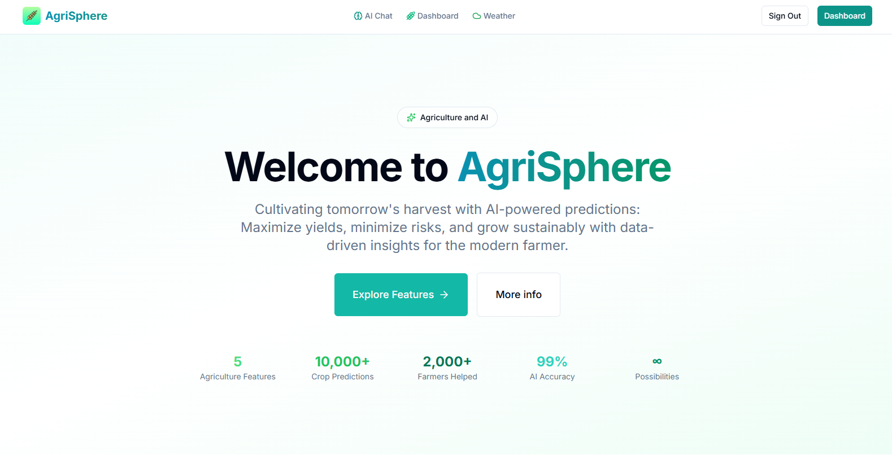
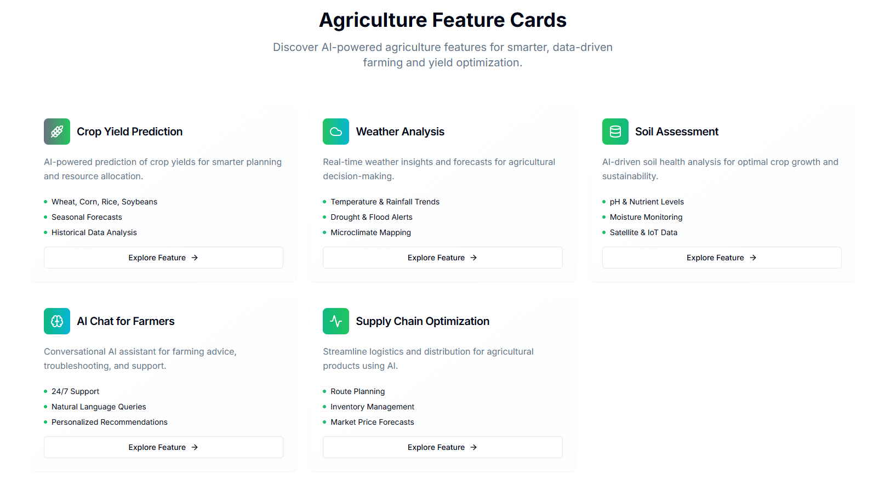
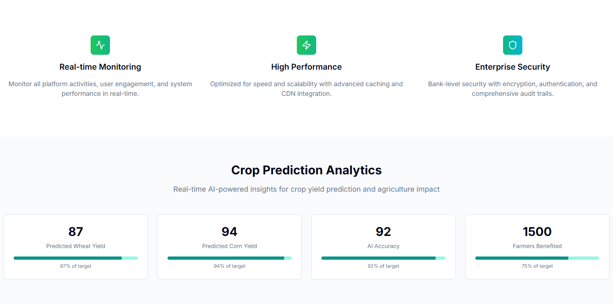
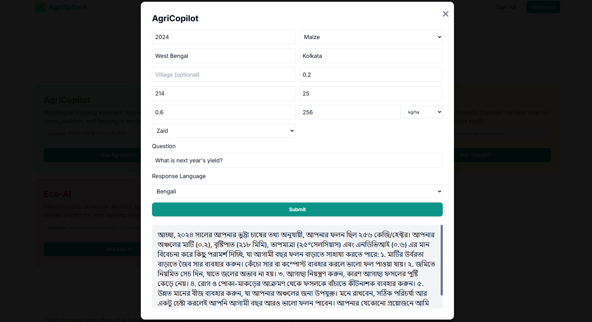
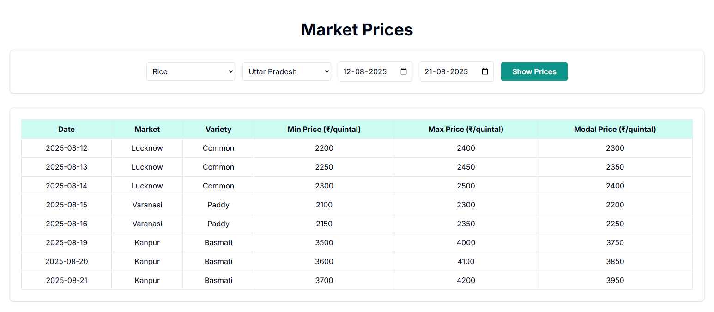

<p align="center">
  
  <h1 style="text-align: center;">AgriSphere</h1>
</p>

---

## Features

- 🌾 **Crop Yield Prediction**: Enter field data and get AI-powered yield predictions for multiple crops.
- 🌦️ **Weather Dashboard**: View past and forecast weather data with interactive charts and horizontal scroll cards.
- 🧑‍🌾 **AgriCopilot**: Multilingual farming assistant for crop, weather, and farming queries.
- 📊 **AgriVision**: Explains farming data in a story form, making yield and weather easy for farmers to grasp.
- 💹 **CropGPT**: Your personalized farming ChatGPT for creative crop planning.
- 💡 **AgriChat**: Creative brainstorming for crop combinations and strategies.
- 🗺️ **Farm Management Dashboard**: Monitor crop health, yield, soil analysis, and supply chain optimization.
- 🔒 **Authentication**: Secure login and access control for all features.

---

## Project Media

### Home Page

  
  
  

### Dashboard


### Ai Features



### Market



## Getting Started

1. **Clone the repository:**
   ```bash
   git clone https://github.com/UniquePratham/PolySphere.git
   cd PolySphere
   ```
2. **Install dependencies:**
   ```bash
   npm install
   # or
   yarn install
   ```
3. **Configure environment variables:**
   - Copy `.env.local.example` to `.env.local` and fill in your API keys and backend URLs.
4. **Run the development server:**
   ```bash
   npm run dev
   # or
   yarn dev
   ```
5. **Open [http://localhost:3000](http://localhost:3000) in your browser.**

## Tech Stack

- [Next.js](https://nextjs.org/) (App Router)
- [React](https://react.dev/)
- [Tailwind CSS](https://tailwindcss.com/)
- [Chart.js](https://www.chartjs.org/) & [react-chartjs-2](https://react-chartjs-2.js.org/)
- [Framer Motion](https://www.framer.com/motion/)
- [Lucide Icons](https://lucide.dev/)
- Custom backend APIs for weather, prediction, and chat

---

## Contributing

Pull requests and feedback are welcome! For major changes, please open an issue first to discuss what you would like to change.

---

## License

This project is licensed under the MIT License.
